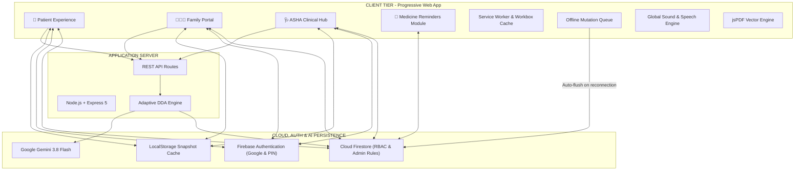
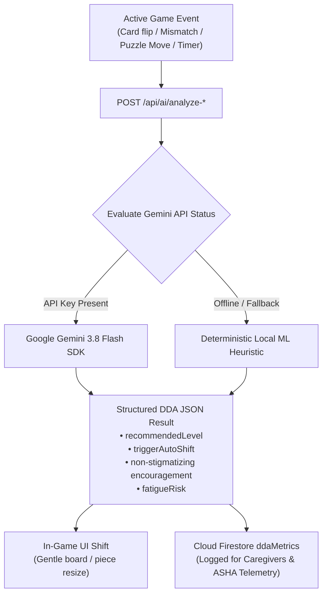
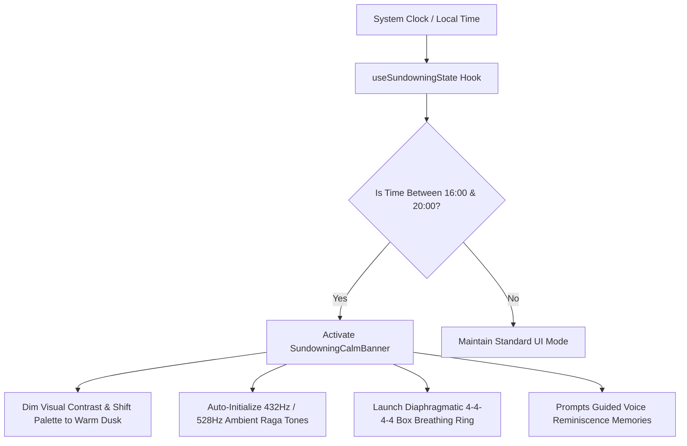
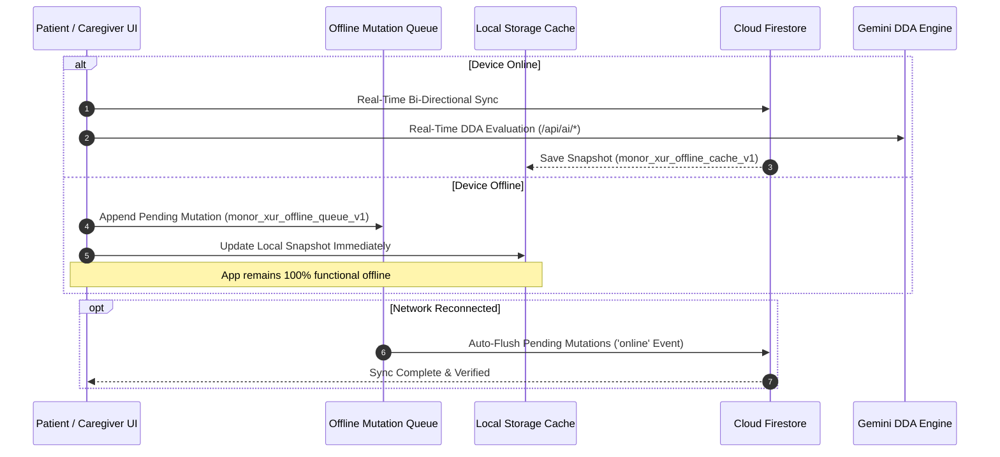

<p align="center">
  
</p>

# 🌿 Monor Xur (मनोर सुर / মনৰ সুৰ)
### *Mobile-First Cognitive Engagement, Dementia Care-Support & Clinical Telemetry Ecosystem*

[](https://opensource.org/licenses/MIT)
[](https://www.typescriptlang.org/)
[](https://reactjs.org/)
[](https://tailwindcss.com/)
[](https://vite-pwa-org.netlify.app/)
[](https://recharts.org/)
[](https://firebase.google.com/)
[](https://expressjs.com/)
[](https://ai.google.dev/)
[](https://nodejs.org/)

---

## 📖 Table of Contents
1. [Overview & Clinical Mission](#-overview--clinical-mission)
2. [Ecosystem Architecture & System Topology](#-ecosystem-architecture--system-topology)
3. [Core Pillars & User Personas](#-core-pillars--user-personas)
4. [💊 Medicine Reminders & Adherence Module](#-medicine-reminders--adherence-module)
5. [🧠 Clinical Dynamic Difficulty Adjustment (DDA) Engine](#-clinical-dynamic-difficulty-adjustment-dda-engine)
6. [💡 Elder Accessibility & Easy-Mode Guidance](#-elder-accessibility--easy-mode-guidance)
7. [📊 Game-Specific Cognitive Analytics & Telemetry](#-game-specific-cognitive-analytics--telemetry)
8. [🎵 Auditory Engineering & Global Sound Controller](#-auditory-engineering--global-sound-controller)
9. [🌅 Sundowning Syndrome Management & Calming Protocol](#-sundowning-syndrome-management--calming-protocol)
10. [🌐 Multilingual Regionalization & Voice Accessibility](#-multilingual-regionalization--voice-accessibility)
11. [💾 Data Persistence & Offline-First Synchronization](#-data-persistence--offline-first-synchronization)
12. [🔒 Admin Security, RBAC & DPDP Act 2023 Compliance](#-admin-security-rbac--dpdp-act-2023-compliance)
13. [📡 API Reference](#-api-reference)
14. [📄 Vector Clinical PDF Report Generator](#-vector-clinical-pdf-report-generator)
15. [📁 Project Directory Structure](#-project-directory-structure)
16. [🚀 Getting Started & Local Development](#-getting-started--local-development)
17. [🚢 Production Deployment & Containerization](#-production-deployment--containerization)
18. [🛡️ Accessibility & Ethical AI Principles](#-accessibility--ethical-ai-principles)
19. [📚 Documentation & Reports](#-documentation--reports)

---

## 📖 Overview & Clinical Mission

**Monor Xur** (*"Tune of the Mind"*) is an offline-capable, mobile-first healthcare web application designed specifically for older adults experiencing **Mild Cognitive Impairment (MCI)** or early-stage **dementia**, their **family caregivers**, and community frontline health workers (**ASHA** – *Accredited Social Health Activists*).

In conventional dementia care, cognitive exercises often feel like stressful tests—causing performance anxiety, agitation, and task abandonment. Monor Xur reimagines this paradigm by combining:
- **Gentle Gerontological UX**: High-contrast, warm cream palette (`#FDFBF7`), deep botanical sage (`#2D3A2F`), generous negative space, large tactile targets ($\ge 48\text{px}$), and zero cognitive clutter.
- **Reminiscence Therapy & Regional Personalization**: Assamese cultural cuisine puzzle collections, regional avatars, custom family photo puzzles, voice journal entries, comforting memories, and authentic raga soundscapes.
- **Invisible Adaptive Intelligence**: Dynamic Difficulty Adjustment (DDA) powered by **Google Gemini 3.8 Flash** with an offline-resilient local ML heuristic fail-safe.
- **Integrated Care Management**: Automated medicine reminders with real-time alert banners, 12h/24h dynamic time conversion, and caregiver/ASHA compliance tracking.
- **Clinical Actionability**: Longitudinal cognitive telemetry, Recharts trend lines, and downloadable clinical PDF dossiers for doctors and neurologists.

---

## 🏛️ Ecosystem Architecture & System Topology

Monor Xur employs a dual-tiered architecture combining a client-side Progressive Web App (PWA) with a Node.js/Express full-stack companion service, Firebase Authentication (Google Auth + PIN), and dual-layer data persistence (Cloud Firestore + Local Storage Queue/Cache).

```
┌────────────────────────────────────────────────────────────────────────────────────────┐
│                                CLIENT TIER (Progressive Web App)                       │
├────────────────────────────────────────────────────────────────────────────────────────┤
│                                                                                        │
│   👵 Patient Experience            👨‍👩‍👧 Family Portal              🩺 ASHA Clinical Hub   │
│   ├── Orientation & Daily Plan     ├── PIN & Google Auth Guard     ├── Household Visit Protocol│
│   ├── Memory Match Game (DDA)      ├── Recharts Cognitive Trends   ├── Vitals & BP Entry │
│   ├── Photo Jigsaw Puzzle (DDA)    ├── Routine & Med Manager       ├── MMSE-Aligned Notes│
│   ├── Medicine Reminders & Alerts  ├── Voice & Photo Reminiscence  ├── Doctor Referrals  │
│   ├── Elder Easy-Mode Audio Guide  ├── Emergency SOS Dispatch      ├── Avatar Profile Mgmt│
│   ├── Diaphragmatic Box Breathing  └── jsPDF Vector Report Engine  └── Task Assignment   │
│   ├── Regional Audio Soundscapes                                                       │
│   └── Web Speech Voice Journals                                                        │
│                                                                                        │
│   ──────────────────────────────────┬───────────────────────────────────────────────   │
│                                     ▼                                                  │
│   [ Service Worker & PWA Cache ]   [ Offline Mutation Queue ]    [ Global Sound Controller ]
│   - Workbox cache (HTML/JS/Assets) - Queue offline reminders    - Auto-cleanup on unmount 
│   - Google Fonts CacheFirst        - Auto-flush on 'online'      - 432Hz/528Hz & MP3 audio │
└─────────────────────────────────────┬──────────────────────────────────────────────────┘
                                      │ HTTP / JSON REST & Firebase Sync
                                      ▼
┌────────────────────────────────────────────────────────────────────────────────────────┐
│                              FULL-STACK APPLICATION SERVER                             │
├────────────────────────────────────────────────────────────────────────────────────────┤
│   Node.js (v20+) + Express 5 Runtime (Port 3000)                                       │
│                                                                                        │
│   ┌───────────────────────────────┐          ┌──────────────────────────────────────┐  │
│   │     REST API Endpoints        │          │       Adaptive Difficulty Engine     │  │
│   │  • GET  /api/health           │ ───────► │  • Gemini 3.8 Flash SDK (GenAI)      │  │
│   │  • POST /api/ai/analyze-diff  │          │  • Deterministic Local ML Heuristic  │  │
│   │  • POST /api/ai/analyze-puzzle│          │  • Cognitive Fatigue & Latency Eval  │  │
│   └───────────────────────────────┘          └──────────────────────────────────────┘  │
│                   │                                              │                     │
│                   ▼                                              ▼                     │
│   ┌───────────────────────────────┐          ┌──────────────────────────────────────┐  │
│   │ Vite SPA Middleware (Dev)     │          │ Bundled Production Dist (esbuild)    │  │
│   │ Vite HMR / Static Asset Serv  │          │ Compiled CJS: dist/server.cjs        │  │
│   └───────────────────────────────┘          └──────────────────────────────────────┘  │
└─────────────────────────────────────┬──────────────────────────────────────────────────┘
                                      │
          ┌───────────────────────────┴───────────────────────────┐
          ▼                                                       ▼
┌───────────────────────────────────┐               ┌───────────────────────────────────┐
│     EXTERNAL AI INTELLIGENCE      │               │  AUTHENTICATION & CLOUD DATABASE  │
├───────────────────────────────────┤               ├───────────────────────────────────┤
│ Google GenAI API                  │               │ Firebase Auth & Cloud Firestore   │
│ • Model: gemini-3.8-flash         │               │ • Google Sign-In & PIN Access     │
│ • Structured JSON Schema Outputs  │               │ • Collection: patients/{id}       │
│ • Cognitive latency & error eval  │               │ • Role-based rules: patient/care/ │
│ • Non-stigmatizing encouragement  │               │   asha/admin access controls      │
└───────────────────────────────────┘               └───────────────────────────────────┘
```

#### GitHub Native Interactive Architecture Diagram


### Detailed Layer Breakdown

| Architectural Layer | Core Technologies | Functional Responsibilities |
| :--- | :--- | :--- |
| **Presentation Layer** | React 18.3, TypeScript 5.7, Tailwind CSS 4 | Gerontological UI components, high-contrast layouts, avatar selection, role-based navigation guards. |
| **Authentication & RBAC** | Firebase Auth, `firestore.rules` | Google OAuth sign-in, PIN authorization, and explicit `isAdmin`, `caregiver`, and `asha` security roles. |
| **Medicine Reminders** | Custom React hooks, `timeUtils.ts` | Scheduled dose tracking, active alert banners, 12h/24h time formatting, adherence status tracking. |
| **Data Visualization** | Recharts 3.10 | Engagement trend lines (`AreaChart`), latency vs. difficulty (`LineChart`), error/hint distribution (`BarChart`). |
| **PWA & Offline Layer** | Vite PWA, Workbox, Service Worker, LocalStorage | Client asset caching, offline snapshot persistence (`offlineStorage.ts`), queue-and-replay mutation sync. |
| **Audio & Speech Engine** | Web Audio API, HTMLAudioElement, Web Speech API | Centralized global audio lifecycle cleanup (`soundController`), Solfeggio soundscapes, regional raga MP3 tracks, voice diary TTS. |
| **Application Server** | Express 5.2, `tsx`, `esbuild` | Host `/api` endpoints, proxy Google GenAI requests, serve static assets and single-page fallback in production. |
| **Cognitive Intelligence** | `@google/genai` (Gemini 3.8 Flash) | Analyzes move latency, consecutive errors, solve times, and emits non-stigmatizing adaptive difficulty shifts. |
| **Cloud Persistence** | Firebase Firestore 12.19 | Real-time bi-directional data synchronization with subcollections for clinical telemetry, reminders, and care plans. |
| **Export & Reporting** | jsPDF 4.2 | Multi-page, print-ready vector PDF document generator for neurologist visits and caregiver reviews. |

---

## 👥 Core Pillars & User Personas

```
                  ┌──────────────────────────────────────────────┐
                  │            MONOR XUR ECOSYSTEM               │
                  └──────────────────────┬───────────────────────┘
                                         │
         ┌───────────────────────────────┼───────────────────────────────┐
         ▼                               ▼                               ▼
  👵 Patient Mode                👨‍👩‍👧 Family Portal              🩺 ASHA Clinical Hub
 • Gentle, High-Contrast UI     • Google Auth & PIN Access     • MMSE-Aligned Logbooks
 • Dynamic Difficulty (DDA)     • Recharts DDA Trend Lines     • Home Visit Checklists
 • Medicine Alert Banners       • Medicine Reminders Manager   • Cognitive Trend Reports
 • Easy-Mode Audio Guidance     • Audio Diary & Photo Gallery  • Vitals & BP Logging
 • Voice Diaries (Web Speech)   • Remote Telemetry Tracking    • Avatar Profile Setup
 • Calming Audio & Breathing    • Vector PDF Clinical Exports  • AI Doctor Consultation Logs
 • Emergency SOS & Reminders    • Cloud Firestore Live Sync    • Multi-Patient Tracking
```

### 1. 👵 Patient Experience (Persona: Anita Sharma, 68)
- **Visual & Temporal Orientation**: Clear, calming greeting with current date, time of day, and comforting affirmations.
- **Medicine Alert Banner & Reminders Module**:
  - Displays upcoming or overdue medication doses directly on the home screen (`MedicineAlertBanner.tsx`).
  - Interactive medication schedule (`MedicineReminders.tsx`) enabling one-tap dose marking with audio confirmation.
- **Cognitive Stimulation Hub**:
  - **Memory Match Game**: Active paired-card recall featuring nature, daily comforts, and musical instruments. Includes elder Easy-Mode guidance.
  - **Photo Jigsaw Puzzle**: Supports both personalized family photo uploads and a **Default Mode** featuring 20 regional Assamese dish puzzles (`dish-1-khar.jpg` through `dish-20-payox.jpg`) segmented into 2×2, 3×3, or 4×4 grid layouts.
- **Elder Easy-Mode Voice Guidance (`EasyModeGuide.tsx`)**:
  - Interactive audio instructions in English, Hindi, and Assamese providing step-by-step game walkthroughs without pressure.
- **Voice Journal & Reminiscence Gallery**:
  - **Elder-Friendly Voice Station**: Uses the browser's **Web Speech Recognition API** for real-time speech-to-text paired with audio recording.
  - **Categorized Memories**: Family, Places, People, Special Moments, and Voice Diaries.
- **Sensory Calming Hub**:
  - **Diaphragmatic 4-4-4-4 Breathing**: Gentle visual pulsing ring guiding inhale, hold, exhale, and rest phases.
  - **Solfeggio & Regional Soundscapes**: Hybrid audio engine playing authentic South Asian instrumental tracks (Sitar & Tanpura, Bansuri Melody, Kirtan, Sandhya Shanti Flute) and Web Audio 432 Hz / 528 Hz binaural raga tones.
- **Daily Living Support**: Visual medication adherence checklists with audio announcements and one-tap emergency calling.

### 2. 👨‍👩‍👧 Family Caregiver Portal (PIN & Google Auth Guarded)
- **Integrated Profile & Avatar Management**:
  - Customize patient profiles with culturally relatable avatars (Assam Aita, Assam Koka, Assam Boanicar, Family Members).
- **Comprehensive Care Sections**:
  1. **Patient Profile & Setup**: Full demographics, stage of cognitive condition, language, primary caregiver identity, and avatar customization.
  2. **Medical Baseline**: Recorded physician consultations, allergies, current prescriptions, and specialist care guidance.
  3. **Medicine Reminders Hub**: Add, update, and monitor daily prescription schedules with customizable dose timings.
  4. **Cognitive Progress & Telemetry**: Recharts graphs analyzing session speed, error rates, and difficulty level shifts.
  5. **Vector PDF Export**: Instant download of comprehensive multi-page clinical summaries.
  6. **Routine & Care Calendar**: Schedule doctor visits, household events, and family visits with Firestore sync.
  7. **Memories & Media Hub**: Upload family pictures, view voice journals, and play recorded audio notes.
  8. **Alert Feeds**: Real-time notifications of missed medications, low engagement, or SOS triggers.
  9. **Emergency Contacts**: Quick-dial configuration for primary doctor, caregiver, and emergency responders.

### 3. 🩺 ASHA Health Worker Portal (Passcode & RBAC Guarded)
- **Community Field Visit Protocol**: Standardized checklist covering hydration inspection, medication box audit, nutrition check, and blood pressure logging.
- **MMSE-Aligned Cognitive Progression**: Observation logs tracking patient orientation, recall speed, and agitation markers.
- **Clinical Summary Formulation**: Synthesizes longitudinal metrics into concise referral summaries for community health clinics (PHCs) and consulting neurologists.

---

## 💊 Medicine Reminders & Adherence Module

To support independence while maintaining strict medical compliance, Monor Xur features a dedicated Medicine Reminders module ([src/components/patient/MedicineReminders.tsx](file:///f:/SIH/Monor-Xur/src/components/patient/MedicineReminders.tsx)) integrated with real-time home alert banners ([src/components/patient/MedicineAlertBanner.tsx](file:///f:/SIH/Monor-Xur/src/components/patient/MedicineAlertBanner.tsx)).

```
┌────────────────────────────────────────────────────────────────────────┐
│                        MEDICINE REMINDERS SYSTEM                       │
├────────────────────────────────────────────────────────────────────────┤
│                                                                        │
│   Caregiver / Doctor Setup           Patient Home Screen               │
│   ┌────────────────────────┐         ┌──────────────────────────────┐  │
│   │ Family Dashboard       │         │ MedicineAlertBanner          │  │
│   │ Add Medication:        │ ──────► │ • Shows upcoming dose time   │  │
│   │ • Name & Dosage        │         │ • Highlights OVERDUE status  │  │
│   │ • Schedule (12h/24h)   │         │ • One-tap "Mark Taken" button│  │
│   └────────────────────────┘         └──────────────┬───────────────┘  │
│                                                     │                  │
│                                                     ▼                  │
│   ┌────────────────────────────────────────────────────────────────┐  │
│   │ MedicineReminders View                                         │  │
│   │ • Full daily schedule breakdown                                │  │
│   │ • Audio voice reading via SpeakButton                          │  │
│   │ • Dose completion status & adherence percentage tracking       │  │
│   └────────────────────────────────────────────────────────────────┘  │
│                                                                        │
└────────────────────────────────────────────────────────────────────────┘
```

### Key Technical Capabilities:
- **Dynamic Time Utilities (`timeUtils.ts`)**: Converts stored 24-hour schedules into localized 12-hour AM/PM formats and calculates time remaining or elapsed for overdue warnings.
- **Real-Time Status Evaluation**: Automatically categorizes medications into `DUE_NOW`, `UPCOMING`, `TAKEN`, or `OVERDUE`.
- **Cloud & Offline Synchronization**: Medication completions immediately update Firestore `patients/{id}/reminders` documents, with automatic fallback queuing when offline.

---

## 🧠 Clinical Dynamic Difficulty Adjustment (DDA) Engine

To eliminate frustration (which induces anxiety and catastrophic reactions in dementia patients) while preventing boredom, Monor Xur implements a clinical DDA engine.

```
       ┌────────────────────────┐
       │   Active Game Event    │  (Card flip / Mismatch / Puzzle Move / Timer)
       └───────────┬────────────┘
                   │
                   ▼
       ┌────────────────────────┐
       │ /api/ai/analyze-...    │
       └───────────┬────────────┘
                   │
         ┌─────────┴─────────┐
         ▼                   ▼
 ┌───────────────┐   ┌───────────────────────┐
 │ Gemini Flash  │   │ Local ML Heuristic    │
 │ 3.8 SDK       │   │ (Offline / Fallback)  │
 └───────┬───────┘   └───────────┬───────────┘
         │                       │
         └─────────┬─────────────┘
                   ▼
       ┌────────────────────────┐
       │ Structured DDA Result  │
       │ • recommendedLevel     │
       │ • triggerAutoShift     │
       │ • non-stigmatizing msg │
       │ • fatigueRisk (L/M/H)  │
       └───────────┬────────────┘
                   │
     ┌─────────────┴─────────────┐
     ▼                           ▼
[ In-Game UI Shift ]    [ Firestore ddaMetrics ]
(Gentle board resize)   (Logged for Caregivers)
```

#### GitHub Native Interactive DDA Flowchart


### Game-Specific Clinical Rules

#### 🎴 Memory Match Game ([src/components/patient/MemoryMatchGame.tsx](file:///f:/SIH/Monor-Xur/src/components/patient/MemoryMatchGame.tsx)):
- **Strict 1-Step Downshift**:
  - *Hard (6 Pairs, Level 3)* $\rightarrow$ If patient reaches **10 total mistakes** or **4 consecutive mismatches**, auto-shifts strictly to **Medium (4 Pairs, Level 2)**. The engine never abruptly drops two levels to Easy.
  - *Medium (4 Pairs, Level 2)* $\rightarrow$ If patient reaches **5 total mistakes** or **3 consecutive mismatches**, auto-shifts to **Easy (3 Pairs, Level 1)**.
- **5-Win Streak Advancement**:
  - Winning **5 consecutive rounds** on Easy prompts advancement to Medium.
  - Winning **5 consecutive rounds** on Medium prompts advancement to Hard.
- **Dignified Language**: Shifts are framed reassuringly: *"Let's take our time on a gentle board so you can relax and enjoy matching."* (Never mentions "mistakes" or "difficulty").

#### 🧩 Photo Jigsaw Puzzle ([src/components/patient/PuzzleGame.tsx](file:///f:/SIH/Monor-Xur/src/components/patient/PuzzleGame.tsx)):
- **Dual Mode Support**: Toggle between personalized family photos and **Default Mode** containing 20 Assamese culinary dish puzzle images.
- **Designated Speed Baselines**:
  - *Easy (2×2)*: 25 seconds
  - *Medium (3×3)*: 45 seconds
  - *Tough (4×4)*: 120 seconds
- **Degrade Trigger**: If solve time exceeds designated baseline by **$+25\text{ seconds}$**, the grid downshifts 1 tier.
- **Promotion Trigger**: Achieving **3 consecutive solves under baseline** queues a pending level upgrade.
- **Pending Upgrade State & Pause Timer**: Introduces a post-puzzle celebration pause before transitioning grid sizes, preventing abrupt board switches.

---

## 💡 Elder Accessibility & Easy-Mode Guidance

Monor Xur incorporates an elder-first guidance system ([src/components/patient/EasyModeGuide.tsx](file:///f:/SIH/Monor-Xur/src/components/patient/EasyModeGuide.tsx)) designed specifically for patients with low tech literacy or cognitive impairment.

### Features of `EasyModeGuide`:
- **Audio Walkthroughs**: Built-in voice narration in English, Hindi, and Assamese explaining game rules step-by-step.
- **Visual Micro-Steps**: Displays simple icon-based instructions (e.g., *1. Tap a piece*, *2. Place on grid*, *3. Use Peek Photo if needed*).
- **Non-Intrusive Guidance**: Can be expanded or collapsed easily, remaining available without crowding the game board.

---

## 📊 Game-Specific Cognitive Analytics & Telemetry

To provide clinicians, neurologists, and family caregivers with precise insights into distinct cognitive domains (e.g., working spatial memory vs. visual-spatial assembly), Monor Xur processes telemetry segmented by game type (`memory_match` vs. `puzzle`) via [src/utils/gameAnalytics.ts](file:///f:/SIH/Monor-Xur/src/utils/gameAnalytics.ts).

```
                              ┌───────────────────────────────┐
                              │     Player Session Stream     │
                              │ (Round, Latency, Mistakes, DDA│
                              └───────────────┬───────────────┘
                                              │
                      ┌───────────────────────┴───────────────────────┐
                      ▼                                               ▼
      ┌───────────────────────────────┐               ┌───────────────────────────────┐
      │      Memory Match Stream      │               │      Photo Puzzle Stream      │
      │  • Working spatial recall     │               │  • Visual-spatial synthesis   │
      │  • Card pair latency tracking │               │  • Assembly speed vs. baseline│
      │  • Mismatch error frequency   │               │  • Hint request tracking      │
      │  • 1-step adaptive tiering    │               │  • Grid scale (2x2, 3x3, 4x4) │
      └───────────────┬───────────────┘               └───────────────┬───────────────┘
                      │                                               │
                      └───────────────────────┬───────────────────────┘
                                              ▼
                              ┌───────────────────────────────┐
                              │    gameAnalytics.ts Engine    │
                              │ • computeGameStats()          │
                              │ • getGameBreakdown()          │
                              │ • filterLogsByGame()          │
                              └───────────────┬───────────────┘
                                              │
              ┌───────────────────────────────┼───────────────────────────────┐
              ▼                               ▼                               ▼
    ┌───────────────────┐           ┌───────────────────┐           ┌───────────────────┐
    │  Family Dashboard │           │  ASHA Health Hub  │           │ Vector PDF Dossier│
    │ • 3-Way Selector  │           │ • Quick Metrics   │           │ • Dual Comparison │
    │ • Recharts Graphs │           │ • Scope Filter Bar│           │ • Scope Selection │
    │ • Trend Lines     │           │ • Clinical Summary│           │ • Labeled Rows    │
    └───────────────────┘           └───────────────────┘           └───────────────────┘
```

### Analytical Capabilities & Metrics
- **Zero Static Mock Data Architecture**: All clinical reports, cognitive insights, Recharts curves, MMSE trajectories, and downloadable PDF dossiers are generated 100% dynamically from real-time gameplay telemetry (`ddaMetrics`) saved during active sessions.
- **Multi-Game Scope Filtering**: Caregivers and health workers can toggle between `All Games` (combined aggregate), `Memory Match Only`, and `Photo Puzzle Only` across dashboards and report generators.
- **Side-by-Side Dual Game Comparison**: Directly contrasts session volume, mean accuracy, decision speed, error rates, and active DDA tiers between Memory Match and Photo Puzzle.
- **Clinical Trend Visualizations**: Uses Recharts to plot chronological accuracy trajectories, move latencies, and adaptive tier progressions.

---

## 🎵 Auditory Engineering & Global Sound Controller

Audio management across Monor Xur is handled by a centralized global sound controller ([src/utils/audio.ts](file:///f:/SIH/Monor-Xur/src/utils/audio.ts)) equipped with automatic lifecycle cleanup hooks.

```
┌────────────────────────────────────────────────────────────────────────┐
│                        GLOBAL AUDIO ARCHITECTURE                       │
├────────────────────────────────────────────────────────────────────────┤
│                                                                        │
│   Web Audio Synthesizer               HTMLAudioElement Regional Tracks │
│   ┌─────────────────────────┐         ┌──────────────────────────────┐ │
│   │ Solfeggio Oscillators   │         │ Regional Raga MP3 Tracks:    │ │
│   │ • 432 Hz Calming Tone   │         │ • Sitar & Tanpura            │ │
│   │ • 528 Hz Harmonic Tone  │         │ • Bansuri Melody             │ │
│   │ • Pentatonic Flip Chimes│         │ • Madhur Madhab Kirtan       │ │
│   └────────────┬────────────┘         │ • Sandhya Shanti Flute       │ │
│                │                      └──────────────┬───────────────┘ │
│                │                                     │                 │
│                └──────────────────┬──────────────────┘                 │
│                                   ▼                                    │
│                   ┌───────────────────────────────┐                    │
│                   │ soundController Singleton     │                    │
│                   │ • Global Play/Pause State     │                    │
│                   │ • Auto-stop on route change   │                    │
│                   │ • Cleanup on unmount          │                    │
│                   └───────────────────────────────┘                    │
│                                                                        │
└────────────────────────────────────────────────────────────────────────┘
```

### Key Technical Capabilities:
- **Global Lifecycle Cleanup**: Integrating `soundController.stopAll()` into navigation change handlers, tab switches, and component unmounting ensures zero overlapping audio playback.
- **Solfeggio Frequencies**: Pure sine/triangle wave generators for 432 Hz and 528 Hz ambient tones.
- **Regional Audio Tracks**: Support for authentic MP3 instrumental soundscapes with client caching via [src/utils/audioStorage.ts](file:///f:/SIH/Monor-Xur/src/utils/audioStorage.ts).

---

## 🌅 Sundowning Syndrome Management & Calming Protocol

**Sundowning Syndrome** is a state of confusion, anxiety, and agitation that commonly affects individuals with dementia or MCI in the late afternoon and early evening (typically between **4:00 PM and 8:00 PM**). Monor Xur incorporates automated, non-invasive clinical interventions ([src/components/patient/SundowningCalmBanner.tsx](file:///f:/SIH/Monor-Xur/src/components/patient/SundowningCalmBanner.tsx)):



---

## 🌐 Multilingual Regionalization & Voice Accessibility

To serve diverse elderly populations across India and global regions, Monor Xur features deep localization and voice-first accessibility:

```
┌─────────────────────────────────────────────────────────────────────────────────┐
│                      MULTILINGUAL & ACCESSIBILITY ENGINE                        │
├─────────────────────────────────────────────────────────────────────────────────┤
│                                                                                 │
│   🇬🇧 English               🇮🇳 Hindi (हिंदी)               🇮🇳 Assamese (অসমীয়া)   │
│   ├── Full UI Strings       ├── Full Localized Dictionary   ├── Native Lexicon        │
│   └── Doctor Telemetry      └── Elder Affirmations          └── Regional Memories     │
│                                                                                 │
│   ──────────────────────────────────┬────────────────────────────────────────   │
│                                     ▼                                           │
│   [ LanguageContext Provider ]    [ SpeakButton Web Speech TTS ]               │
│   - Dynamic language switcher     - Native Web Speech synthesis                │
│   - LocalStorage preference sync  - One-tap audio reading for low-literacy     │
└─────────────────────────────────────────────────────────────────────────────────┘
```

### Key Accessibility Capabilities:
- **Comprehensive Lexicon Dictionaries**:
  - `assameseDictionary.ts`: Native Assamese lexicon covering orientation, daily routine, culinary dish puzzles, and game instructions.
  - `translations.ts`: Complete English and Hindi translation dictionaries.
- **Voice-First Audio Reading ([src/components/common/SpeakButton.tsx](file:///f:/SIH/Monor-Xur/src/components/common/SpeakButton.tsx))**: Integrates Web Speech Synthesis (`window.speechSynthesis`) for one-tap reading of instructions, reminders, and daily affirmations.

---

## 💾 Data Persistence & Offline-First Synchronization

Monor Xur is engineered for high availability in rural and semi-urban settings with unstable internet connectivity.

```
                  ┌────────────────────────────────┐
                  │    Patient / Caregiver UI      │
                  └───────┬────────────────┬───────┘
                          │                │
            [Online Read] │                │ [Offline Write]
                          ▼                ▼
           ┌─────────────────────┐  ┌──────────────────────────────┐
           │ Firebase Firestore  │  │ LocalStorage Mutation Queue  │
           │ (Real-Time listener)│  │ (monor_xur_offline_queue_v1) │
           └──────────────┬──────┘  └──────────────┬───────────────┘
                          │                        │
                          │   Network Reconnected  │
                          │ ◄──────────────────────┘
                          │ (Flushes queued mutations: reminders,
                          │  care tasks, profile updates)
                          ▼
           ┌────────────────────────────────┐
           │ Offline Snapshot LocalStorage  │
           │ (monor_xur_offline_cache_v1)   │
           └────────────────────────────────┘
```

#### GitHub Native Interactive Persistence Sequence


---

## 🔒 Admin Security, RBAC & DPDP Act 2023 Compliance

Monor Xur strictly adheres to India's **Digital Personal Data Protection (DPDP) Act, 2023** and healthcare security best practices.

### 1. Firestore Security Rules & RBAC Structure ([firestore.rules](file:///f:/SIH/Monor-Xur/firestore.rules))
- **Role-Based Access Control**: Enforces specific access conditions for `patient`, `caregiver`, `asha`, and `isAdmin` roles.
- **Admin Access Overrides**: Admins have audited read/write permissions for clinical supervision across authorized patient documents.

```javascript
// Scopes patient documents to authorized caregivers, ASHA workers, and system admins
function isAssignedCaregiverOrAsha(patientId) {
  let profile = get(/databases/$(database)/documents/patients/$(patientId)).data;
  return request.auth != null && (
    request.auth.uid == patientId ||
    request.auth.uid == profile.caregiver.id ||
    request.auth.uid in profile.authorizedUids ||
    request.auth.token.role == "caregiver" ||
    request.auth.token.role == "asha" ||
    request.auth.token.role == "admin"
  );
}
```

### 2. DPDP Act 2023 Statutory Compliance Framework
- **Explicit Consent**: Mandatory opt-in recorded during initial onboarding.
- **Data Minimization**: Collects only essential cognitive telemetry, reminiscence assets, and routine schedules.
- **Right to Access & Erase**: Self-service profile and media deletion tools in the Family Portal.
- **Immutable Audit Trail**: Append-only event logging in `patients/{patientId}/auditLogs`.

---

## 📡 API Reference

The Node.js Express server (`server.ts`) exposes high-performance endpoints:

### 1. Health & Status
- **Endpoint**: `GET /api/health`
- **Response**:
  ```json
  {
    "status": "ok",
    "app": "Monor Xur",
    "aiAvailable": true
  }
  ```

### 2. Memory Match Difficulty Analysis
- **Endpoint**: `POST /api/ai/analyze-difficulty`
- **Payload**:
  ```json
  {
    "playerName": "Anita Sharma",
    "currentLevel": 3,
    "moves": 14,
    "mistakes": 10,
    "consecutiveMistakes": 4,
    "matchedPairs": 2,
    "totalPairs": 6,
    "elapsedSeconds": 62,
    "triggerEvent": "mistake",
    "consecutiveWins": 0
  }
  ```
- **Response**:
  ```json
  {
    "action": "EASE_DIFFICULTY",
    "recommendedLevel": 2,
    "triggerAutoShift": true,
    "reasoning": "Player reached threshold on Level 3 (10 mistakes, 4 consecutive). Auto-shifting 1 step to Medium (4 Pairs) to reduce cognitive load.",
    "encouragement": "You're doing wonderfully, Anita! Let's step down to a 4-pair board so you can relax and enjoy.",
    "fatigueRisk": "HIGH",
    "modelSource": "gemini-3.8-flash",
    "timestamp": 1789134567890
  }
  ```

### 3. Puzzle Difficulty Analysis
- **Endpoint**: `POST /api/ai/analyze-puzzle-difficulty`
- **Payload**:
  ```json
  {
    "playerName": "Anita Sharma",
    "currentGrid": 3,
    "timeTaken": 75,
    "previousAverageSeconds": 45,
    "designatedAverageSeconds": 45,
    "consecutiveSolves": 0,
    "triggerEvent": "round_complete"
  }
  ```
- **Response**:
  ```json
  {
    "action": "EASE_DIFFICULTY",
    "currentGrid": 3,
    "recommendedGrid": 2,
    "triggerAutoShift": true,
    "reasoning": "Solve time (75s) exceeded designated baseline (45s) by >25 seconds. Easing to 2x2 grid.",
    "encouragement": "Lovely patience, Anita. Let's play with fewer pieces so you can relax.",
    "fatigueRisk": "MODERATE",
    "modelSource": "gemini-3.8-flash",
    "timestamp": 1789134589123
  }
  ```

---

## 📄 Vector Clinical PDF Report Generator

Monor Xur includes a client-side vector document compiler powered by **jsPDF** ([src/utils/pdfReportGenerator.ts](file:///f:/SIH/Monor-Xur/src/utils/pdfReportGenerator.ts)):
- **Format**: Structured medical dossier in A4 format.
- **Dynamic Game Scope Configuration**: Toggle between aggregate (`All Games`), `Memory Match Only`, or `Photo Puzzle Only` report generation.
- **Sections**:
  1. **Executive Clinical Summary**: Demographics, cognitive stage, primary physician, emergency contacts.
  2. **Cognitive Telemetry & DDA Trends**: Accuracy percentage, response latencies, side-by-side game comparison panels, and historical telemetry table.
  3. **Physician Visit & Prescription Logs**: Consult history, care guidance, and active medication schedule compliance.
  4. **ASHA Field Visit Observations**: Vital signs, hydration, blood pressure logs, and MMSE orientation observations.
  5. **Standard Geriatric Disclaimer**: Medical notice regarding non-diagnostic assistive technology.

---

## 📁 Project Directory Structure

```
Monor-Xur/
├── firestore.rules               # Firebase Firestore RBAC Security Rules (Admin, Caregiver, ASHA)
├── package.json                  # NPM dependencies & build scripts
├── server.ts                     # Full-stack Node.js Express server with Vite SPA middleware
├── tsconfig.json                 # TypeScript compiler configuration
├── vite.config.ts                # Vite PWA build setup & bundle configuration
├── public/                       # Static public assets
│   ├── audio/                    # Ambient MP3 soundscapes (Sitar, Bansuri, Kirtan, Flute)
│   ├── images/
│   │   ├── avatars/              # Cultural & family profile avatars (Assam Aita, Koka, etc.)
│   │   └── puzzles/              # 20 Native Assamese dish puzzle assets (Khar, Pitha, etc.)
│   └── pwa-192x192.png           # PWA web manifest icons
└── src/                          # Application source code
    ├── App.tsx                   # Main React entrypoint & routing navigation
    ├── index.css                 # Global CSS & Tailwind CSS 4 setup
    ├── main.tsx                  # React root DOM renderer
    ├── types.ts                  # TypeScript definitions (Patient, DDA, Medicines, Telemetry)
    ├── assets/                   # Bundled project assets
    ├── components/
    │   ├── caregiver/            # Caregiver & ASHA portals
    │   │   ├── AshaDashboard.tsx
    │   │   ├── AshaLogin.tsx
    │   │   ├── CaregiverSelect.tsx
    │   │   ├── CognitiveProgressView.tsx
    │   │   ├── ExportPdfModal.tsx
    │   │   ├── FamilyDashboard.tsx
    │   │   ├── FamilyLogin.tsx
    │   │   └── MemoryInsightsView.tsx
    │   ├── common/               # Shared reusable components
    │   │   ├── BottomNav.tsx
    │   │   ├── DifficultyToast.tsx
    │   │   ├── Header.tsx
    │   │   ├── OfflineIndicator.tsx
    │   │   ├── PWAInstallButton.tsx
    │   │   ├── SpeakButton.tsx
    │   │   └── VoiceReminiscenceRecorder.tsx
    │   ├── patient/              # Patient cognitive experience
    │   │   ├── AudioDiaryRecorder.tsx
    │   │   ├── BreathingExercise.tsx
    │   │   ├── DailyLife.tsx
    │   │   ├── EasyModeGuide.tsx        # Elder-first guided game audio instructions
    │   │   ├── GamesHub.tsx
    │   │   ├── MedicineAlertBanner.tsx  # Home screen upcoming/overdue medicine alerts
    │   │   ├── MedicineReminders.tsx    # Interactive medicine schedule & adherence tracking
    │   │   ├── MemoriesGallery.tsx
    │   │   ├── MemoryMatchGame.tsx      # DDA-powered memory card match game
    │   │   ├── MemoryViewer.tsx
    │   │   ├── PatientHome.tsx          # Elder home dashboard
    │   │   ├── PatientSettings.tsx      # High-contrast & theme controls
    │   │   ├── PuzzleGame.tsx           # DDA-powered jigsaw puzzle (Default & Custom photos)
    │   │   ├── RelaxationHub.tsx
    │   │   ├── RelaxationMusic.tsx      # Solfeggio & regional audio player
    │   │   └── SundowningCalmBanner.tsx # Evening sundowning syndrome intervention
    │   └── setup/
    │       └── InitialSetupPage.tsx     # Onboarding setup with avatar selection
    ├── context/                  # React state providers
    │   ├── AuthContext.tsx       # Firebase Auth & Google Sign-In state
    │   ├── CaregiverContext.tsx  # Caregiver data provider
    │   ├── LanguageContext.tsx   # Multilingual i18n switcher
    │   ├── PatientContext.tsx    # Active patient profile state
    │   └── ThemeContext.tsx      # Visual contrast & theme management
    ├── data/
    │   └── mockData.ts           # Baseline defaults & fallback initializers
    ├── i18n/                     # Localization dictionaries
    │   ├── assameseDictionary.ts # Native Assamese vocabulary & dish labels
    │   └── translations.ts       # English & Hindi translation lexicons
    ├── services/                 # External service integrations
    │   ├── aiDifficultyService.ts# Gemini 3.8 Flash SDK & local DDA engine
    │   └── firebase.ts           # Firebase App, Auth, Firestore DB & Sync handlers
    └── utils/                    # Helper utilities
        ├── audio.ts              # Global soundController singleton & audio lifecycle
        ├── audioStorage.ts       # Track caching & audio asset preloader
        ├── gameAnalytics.ts      # Telemetry calculations & Recharts transformers
        ├── offlineStorage.ts     # Offline queue & local snapshot storage
        ├── pdfReportGenerator.ts # jsPDF vector clinical report engine
        └── timeUtils.ts          # 12h/24h time converters & medicine alert helpers
```

---

## 🚀 Getting Started & Local Development

### Prerequisites
- **Node.js**: `v20.0.0` or higher
- **npm**: `v10.0.0` or higher
- **Google Gemini API Key**: Obtainable from [Google AI Studio](https://aistudio.google.com/)

### Installation & Setup

1. **Clone the Repository**:
   ```bash
   git clone https://github.com/simrangupta8920-spec/Monor-Xur.git
   cd Monor-Xur
   ```

2. **Install Dependencies**:
   ```bash
   npm install
   ```

3. **Configure Environment Variables**:
   Create a `.env` file in the root directory:
   ```env
   GEMINI_API_KEY=your_gemini_api_key_here
   VITE_FIREBASE_API_KEY=your_firebase_api_key
   VITE_FIREBASE_AUTH_DOMAIN=your_project.firebaseapp.com
   VITE_FIREBASE_PROJECT_ID=your_project_id
   VITE_FIREBASE_STORAGE_BUCKET=your_project.appspot.com
   VITE_FIREBASE_MESSAGING_SENDER_ID=your_sender_id
   VITE_FIREBASE_APP_ID=your_app_id
   ```

4. **Launch Development Server**:
   ```bash
   npm run dev
   ```
   Open your browser at `http://localhost:3000`.

---

## 📜 Available NPM Scripts

| Command | Action | Description |
| :--- | :--- | :--- |
| `npm run dev` | `tsx server.ts` | Boots the full-stack server on port 3000 with live Vite middleware |
| `npm run build` | `vite build && esbuild server.ts ...` | Compiles client assets into `dist/` and bundles server into `dist/server.cjs` |
| `npm start` | `node dist/server.cjs` | Runs the standalone compiled production CommonJS server |
| `npm run lint` | `tsc --noEmit` | Validates TypeScript syntax, interfaces, and strict type safety |
| `npm run preview` | `vite preview --port 3000` | Serves compiled `dist` directory locally |

---

## 🚢 Production Deployment & Containerization

### Docker Deployment
The project is built to execute cleanly in standardized container environments (such as **Google Cloud Run**):

```dockerfile
FROM node:20-slim AS builder
WORKDIR /app
COPY package*.json ./
RUN npm ci
COPY . .
RUN npm run build

FROM node:20-slim AS runner
WORKDIR /app
ENV NODE_ENV=production
ENV PORT=3000
COPY package*.json ./
RUN npm ci --omit=dev
COPY --from=builder /app/dist ./dist
EXPOSE 3000
CMD ["node", "dist/server.cjs"]
```

---

## 🛡️ Accessibility & Ethical AI Principles

1. **WCAG 2.1 AA Compliance**:
   - Contrast ratios surpass $\ge 4.5:1$ for body text and $\ge 7:1$ for large text headers.
   - Clickable touch boundaries strictly measure $\ge 48\text{px} \times 48\text{px}$ to accommodate intention tremors.
2. **Zero Involuntary Disclosures**:
   - All AI prompts are constrained to ensure clinical terms like *"dementia"*, *"cognitive decline"*, or *"mistake"* are never displayed to the patient.
   - Adaptations are positioned as relaxing choices rather than performance remedies.
3. **Privacy by Design**:
   - API secrets remain isolated on the Node.js server.
   - Voice transcriptions are executed locally in the browser via the SpeechRecognition API without external third-party data broker routing.

---

## 📚 Documentation & Reports

| Document | Description |
| :--- | :--- |
| 🔒 [Security](https://docs.google.com/document/d/1vK3KKqlONC3mx6ezw8ZPS_OR5B6Av1sD/edit?usp=sharing&ouid=116529789348167297192&rtpof=true&sd=true) | Security architecture, threat model & data protection practices |
| 🚶 [Product Walkthrough](https://docs.google.com/document/d/1aPvbmUnfjXrPrNJxHiNazxV9XOY6_jfX/edit?usp=sharing&ouid=116529789348167297192&rtpof=true&sd=true) | End-to-end walkthrough of the product experience |
| 🎯 [Relevancy](https://docs.google.com/document/d/1z0KOzhswrWTYDxXBaObpOaIWIz_nYIg6/edit?usp=sharing&ouid=116529789348167297192&rtpof=true&sd=true) | Clinical relevancy & problem-fit rationale |
| 📈 [Scalability](https://docs.google.com/document/d/14UwkMcPDlfIEIWVgEKabzuAIQYc0QgOy/edit?usp=sharing&ouid=116529789348167297192&rtpof=true&sd=true) | Scalability approach & infrastructure planning |

---

<p align="center">
  Crafted with care for people and families everywhere navigating memory challenges.
</p>
